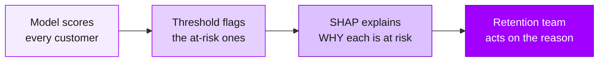

<div align="center">

# 📘 Accenture Project Cycle Datathon
## Customer Churn & Retention — The Complete Info Pack

*Everything the workshop covers, written to be **read on its own** — no live presenter required.*

</div>

---

## How to use this pack

This document is the **narrated version** of the three workshop notebooks. Each part explains *what*
we're doing, *why* it matters, and *how* the code achieves it — in plain English, with the key
snippets inline. You can read it straight through like a handbook, or keep it open beside the
notebooks as a companion guide.

| Part | Notebook | You'll learn to… |
|------|----------|------------------|
| [1 · Data Cleaning](#part-1--data-cleaning) | `cleaning.ipynb` | Turn messy raw data into a trustworthy dataset |
| [2 · EDA & Feature Engineering](#part-2--eda--feature-engineering) | `EDA_feature_engineering.ipynb` | Find signals and prepare features for a model |
| [3 · Modelling](#part-3--modelling) | `modelling.ipynb` | Train, tune, evaluate, and explain a model |

There's also a [Glossary](#-glossary) at the end and a set of [Datathon tips](#-datathon-tips) to help
you win.

---

## The mission

You work on the customer-retention team for a SaaS product. Every customer who quietly cancels is lost
revenue — and by the time you *notice* they've gone, it's too late to win them back. So the business
asks a sharper question:

> **Can we predict which customers are about to churn — early enough to act — and understand *why*?**

That single question drives the entire project cycle. "Churn" here means a customer who left within
**30 days** (the `churned_30d` column). Everything we build is aimed at flagging those customers before
they go, and explaining what's putting them at risk.

### The data

Four synthetic tables describe the customers and their behaviour:

| Table | One row per… | The story it tells |
|-------|--------------|--------------------|
| **users.csv** | customer | Who they are: plan tier, company size, region, industry — plus the **churn labels** we predict. |
| **sessions.csv** | login session | How they show up: device, OS, app version, session length. |
| **events.csv** | in-app action | What they *do*: which features, success/failure, latency. |
| **billing.csv** | customer-month | The money: MRR, active seats, discounts, overdue invoices, support tickets. |

The starter workshop focuses on **`users.csv`**. The other three tables are where the richest signals
hide — see [Datathon tips](#-datathon-tips).

---

# Part 1 · Data Cleaning

> 📓 Notebook: [`content/cleaning.ipynb`](content/cleaning.ipynb)

**Garbage in, garbage out.** A model is only ever as good as the data it learns from, so before any
modelling we make the data *trustworthy*. Cleaning has three jobs: remove what's duplicated, fix what's
inconsistent, and deal with what's missing.

We start by loading the users table:

```python
import pandas as pd

df = pd.read_csv("../data/raw_data/users.csv")
df.head()
```

### 1.1 Duplicate values

Duplicate rows quietly **skew** everything — the model sees the same customer twice and treats that
pattern as more important than it really is.

```python
df.duplicated().sum()
```

A subtle point: duplicates aren't always *exact* copies. If a user submitted the same form twice, the
timestamp might differ while everything else is identical. So it's worth checking for duplicates on the
columns that *should* be unique — here, `user_id`:

```python
df1 = df.drop_duplicates(subset=["user_id"], keep="first")
print(len(df), len(df1))
```

In this dataset we're lucky — no duplicates either way. But you should always *check* rather than
assume.

### 1.2 Inconsistent formatting

Humans read "Sydney" and "sydney" as the same city. A machine-learning model reads them as **two
completely different categories**. Inconsistent capitalisation, stray whitespace, or mixed date formats
all fragment your data and confuse the model.

```python
df.info()                      # data types and non-null counts
df["region"].value_counts()    # what categories actually exist?
```

`value_counts()` is your best friend here — it surfaces the "sydney vs Sydney vs SYD" problem instantly
by showing every distinct value and how often it appears.

### 1.3 Missing values

Real data has holes. First, find them:

```python
df.isnull().sum()      # count of missing values per column
```

Here, **`region`** has a handful of missing entries. You now have two options.

**Option A — drop the rows.** If only a few rows are affected, the simplest fix is to remove them:

```python
df1 = df.dropna().reset_index(drop=True)
print(f"Before: {len(df)}   After: {len(df1)}")
```

The cost: you throw away every *other* value in those rows too. Fine for a handful of rows; wasteful if
many rows have a single gap.

**Option B — impute (estimate) the missing value.** When the data matters or gaps are common, we fill
them in with a sensible guess:

- **Numerical columns** → use the column's **mean** or **median** (simple, fast, slightly less accurate).
- **Categorical columns** → use the **most common category** (the mode), or a placeholder like `"unknown"`.
- **Advanced** → KNN or model-based imputation actually *predicts* the missing value from the other
  columns. More accurate, much more expensive.

`region` is categorical, so we impute with the **mode** (most frequent value):

```python
from sklearn.impute import SimpleImputer
import numpy as np

imputer = SimpleImputer(missing_values=np.nan, strategy="most_frequent")
```

> [!WARNING]
> **⚠️ The single most important rule in this notebook: split *before* you impute.**
>
> If you calculate the "most frequent region" using the *whole* dataset and then evaluate on part of
> it, information from your test set has leaked into your training set. Your scores will look great and
> then collapse in the real world. This is called **data leakage**. Always **fit the imputer on the
> training data only**, then *apply* it to both.

### The train / test split

We split the data into a **training set** (the model learns from it) and a **test set** (held back to
honestly measure performance on data the model has never seen):

```python
X = df.drop(["churned_30d", "churned_90d"], axis=1)   # features
y = df["churned_30d"]                                  # what we predict

X_train, X_test, y_train, y_test = train_test_split(
    X, y,
    test_size=0.2,       # 80% train, 20% test
    stratify=y,          # keep the churn ratio identical in both splits
    random_state=42      # reproducible: same split every run
)
```

Two choices worth understanding:

- **`stratify=y`** — churners are rare. Without stratifying, a random split might land most churners in
  one side. Stratifying keeps the same churn *proportion* in both train and test. (Check the balance
  with `y.value_counts()` — you'll see far more retained customers than churned ones.)
- **`random_state=42`** — fixes the randomness so you get the *same* split every time. Essential for
  reproducible results.

Now we impute — **fit on train, transform both**:

```python
X_train["region_imputed"] = imputer.fit_transform(X_train[["region"]])   # fit + apply
X_test["region_imputed"]  = imputer.transform(X_test[["region"]])        # apply only
```

Then drop the original messy column, keeping the clean `region_imputed`:

```python
X_train = X_train.drop(["region"], axis=1)
X_test  = X_test.drop(["region"], axis=1)
```

### Save the cleaned data

Cleaning is done, so we persist the results. The next two notebooks read these files instead of
re-cleaning from scratch:

```python
X_train.to_csv("../data/processed_data/X_train.csv", index=False)
X_test.to_csv("../data/processed_data/X_test.csv", index=False)
y_train.to_csv("../data/processed_data/y_train.csv", index=False)
y_test.to_csv("../data/processed_data/y_test.csv", index=False)
```

✅ **Part 1 takeaway:** trustworthy data first. Check duplicates, standardise formats, handle missing
values deliberately — and **split before you impute** to avoid leakage.

---

# Part 2 · EDA & Feature Engineering

> 📓 Notebook: [`content/EDA_feature_engineering.ipynb`](content/EDA_feature_engineering.ipynb)

**EDA (Exploratory Data Analysis)** is the detective phase: we look at the data to build intuition
*before* modelling. **Feature engineering** is the craft phase: we reshape the data into the form a
model can actually learn from. Good work here beats a fancier model almost every time.

We begin by loading the cleaned training data from Part 1:

```python
X_train = pd.read_csv("../data/processed_data/X_train.csv")
y_train = pd.read_csv("../data/processed_data/y_train.csv")
target_col = "churned_30d"
```

### 2.1 Visualise the data

Charts reveal skewness, outliers, and — crucially — **class imbalance**. Churn problems are almost
always imbalanced: far more customers stay than leave. Knowing this upfront changes how we model and
evaluate later.

```python
import seaborn as sns
import matplotlib.pyplot as plt

temp_df = X_train.copy()
temp_df[target_col] = y_train[target_col]

sns.countplot(data=temp_df, x="plan_tier", hue=target_col)
plt.title("30-Day Churn Distribution by Plan Tier")
plt.show()
```

**Categorical distributions** — how much data sits in each category? A category with only a few rows
can't teach the model much:

```python
sns.countplot(data=temp_df, x="plan_tier")           # plan tier
sns.countplot(data=temp_df, x="company_size",
              order=["1-10","11-50","51-200","200+"]) # company size, sensibly ordered
sns.countplot(data=temp_df, x="industry")            # industry
```

**Feature vs churn** — the key question: does a feature *relate* to churning? By splitting each bar by
churn status (`hue="churned_30d"`) we can eyeball whether, say, one plan tier or acquisition channel
churns more than others:

```python
sns.countplot(data=temp_df, x="plan_tier", hue="churned_30d")          # churn by plan
sns.countplot(data=temp_df, x="acquisition_channel", hue="churned_30d") # churn by channel
sns.countplot(data=temp_df, x="region_imputed", hue="churned_30d")      # churn by region
sns.countplot(data=temp_df, x="is_enterprise", hue="churned_30d")       # churn by enterprise
```

> 💡 Whenever a chart suggests a pattern, ask **"does this make business sense?"** Domain knowledge
> turns a coincidence into a credible signal. A spike in churn among trial-channel signups, for
> instance, matches what we'd expect — low-commitment users churn more.

**Product signals vs churn** — behavioural columns are often the strongest predictors. Here a
`barplot` shows the average churn *rate* for each group:

```python
sns.barplot(data=temp_df, x="downgraded", y="churned_30d")        # did downgrading precede churn?
sns.barplot(data=temp_df, x="expansion_event", y="churned_30d")   # did expanding reduce churn?
```

We can also **extract new signal from dates**. A raw signup date is hard for a model to use, but the
*month* of signup might reveal seasonality:

```python
temp_df["signup_date"]  = pd.to_datetime(temp_df["signup_date"])
temp_df["signup_month"] = temp_df["signup_date"].dt.month
sns.barplot(data=temp_df, x="signup_month", y="churned_30d")      # churn rate by signup month
```

**Interactions** — sometimes two features only matter *together*. Do enterprise customers cluster in
certain plan tiers? Do downgrades concentrate in one tier?

```python
sns.countplot(data=temp_df, x="plan_tier", hue="is_enterprise")
sns.countplot(data=temp_df, x="plan_tier", hue="downgraded")
sns.countplot(data=temp_df, x="plan_tier", hue="expansion_event")
```

### Feature importance (a first look, via correlation)

**Correlation** measures how strongly a numeric feature moves with churn. It's a quick way to rank
candidate predictors:

```python
correlations = temp_df.select_dtypes(include="number").corr()["churned_30d"]
feature_corr = correlations.drop("churned_30d").sort_values()
feature_corr.plot(kind="barh")   # green = most positive, red = most negative
```

> [!CAUTION]
> **Correlation is not causation.** A feature correlating with churn doesn't mean it *causes* churn — it
> just tends to move alongside it. Correlation is a hint about what *might* be useful to a model, not
> proof of a cause.

### 2.2 Feature extraction

Now we reshape features into forms a model can compute with:

```python
X_train = X_train.drop("user_id", axis=1)                          # IDs carry no signal → drop
X_train["signup_month"] = pd.to_datetime(X_train["signup_date"]).dt.month
X_train = X_train.drop("signup_date", axis=1)                      # keep the month, drop the raw date
X_train["is_enterprise"] = X_train["is_enterprise"].astype(int)   # True/False → 1/0
```

Three moves, three reasons: `user_id` is a unique label with no predictive value; the raw date is
converted into a numeric `signup_month`; and booleans become `1`/`0` because models work in numbers,
not `True`/`False`.

### 2.3 Encoding categorical variables

Models can't read `"premium"` or `"software"` — they need numbers. **Encoding** converts categories to
numeric form, and *which* encoding you choose depends on whether the category has a natural order.

**Ordinal encoding** — when order *matters*. Company size has a clear ranking, so we map it to ordered
integers:

```python
tier_company_size = {"1-10": 0, "11-50": 1, "51-200": 2, "200+": 3}
X_train["company_size_encoded"] = X_train["company_size"].map(tier_company_size)
```

**One-hot encoding** — when there's *no* order. Region, industry, and acquisition channel have no
inherent ranking (is `software` > `education`? No). One-hot creates a separate 0/1 column for each
category, so the model never invents a fake ordering:

```python
from sklearn.preprocessing import OneHotEncoder

cat_cols = ["region_imputed", "industry", "acquisition_channel"]
encoder = OneHotEncoder(drop="first", sparse_output=False)
encoded = encoder.fit_transform(X_train[cat_cols])
```

*(`drop="first"` removes one redundant column per feature — with `is_EU` and `is_NA`, the third region
is implied, which keeps the features from being perfectly collinear.)*

### Correlation analysis & feature selection

With everything numeric, we can view the **full correlation matrix** as a heatmap and then keep only
the features that carry some signal:

```python
corr_matrix = train_full.corr()
sns.heatmap(corr_matrix, cmap="coolwarm", center=0)

correlations   = corr_matrix[target_col].abs()
strong_features = correlations[correlations > 0.05].index.tolist()   # keep |corr| > 0.05
```

You'll notice **many features correlate only weakly** with churn. Don't panic — that's normal, and there
are two honest reasons:

1. **Pearson correlation only measures *linear* relationships.** A feature with a curved (non-linear)
   relationship to churn shows up as weak here but can still be highly useful to a tree-based model.
   Spearman or Kendall-Tau correlations can catch some of these.
2. **These may simply not be the best features yet.** The strongest signals often live in the
   `sessions`, `events`, and `billing` tables you haven't touched yet — engineer features from those.

✅ **Part 2 takeaway:** look before you model. Visualise distributions and churn relationships, engineer
features (dates → months, booleans → 0/1), encode categories correctly (ordinal *vs* one-hot), and
remember weak linear correlation doesn't mean a feature is useless.

---

# Part 3 · Modelling

> 📓 Notebook: [`content/modelling.ipynb`](content/modelling.ipynb)

Now we build the model that predicts churn. The arc: **baseline → evaluate → tune → try a stronger
model → explain**. We never chase a fancy model first; we get a simple one working, measure it
honestly, then improve.

### The toolkit

```python
from sklearn.ensemble import RandomForestClassifier
import xgboost as xgb
import shap
```

- **`scikit-learn`** — models, evaluation metrics, hyperparameter tuning.
- **`xgboost`** — gradient boosting, often a top performer on tabular data.
- **`shap`** — explains *why* the model made each prediction.

### Baseline: Random Forest

A **Random Forest** builds many decision trees on random subsets of the data and averages their votes.
It's a strong, forgiving baseline. The starter notebook includes a deliberate teaching moment:

```python
rf_model = RandomForestClassifier(random_state=42)
rf_model.fit(X_train, y_train.values.ravel())   # 💥 fails — raw text columns still present
```

This **fails on purpose**. Random Forests in scikit-learn can't handle raw text — a reminder that all
the encoding from Part 2 isn't optional. Once every categorical column is encoded (ordinal for
`company_size`, one-hot for the rest) and train/test columns are aligned, it fits cleanly:

```python
rf_model = RandomForestClassifier(class_weight="balanced", random_state=42)
rf_model.fit(X_train, y_train.values.ravel())

y_pred       = rf_model.predict(X_test)                  # class: churn / no-churn
y_pred_proba = rf_model.predict_proba(X_test)[:, 1]      # probability of churn
```

> 💡 **`class_weight="balanced"`** tells the model to pay proportionally more attention to the rare
> churners. Without it, an imbalanced model can score well by simply predicting "nobody churns."

### Evaluating the model — properly

This is where most beginners go wrong, so we do it carefully. **Accuracy alone is a trap.** If only 5%
of customers churn, a model that predicts "no churn" for *everyone* is 95% accurate — and completely
useless. We need metrics that respect the imbalance:

| Metric | Question it answers | Why it matters for churn |
|--------|---------------------|--------------------------|
| **Accuracy** | Overall, how many predictions were right? | Misleading on imbalanced data — use with caution. |
| **Precision** | Of those we *flagged* as churners, how many really churned? | High precision = few false alarms. |
| **Recall** | Of all the *real* churners, how many did we catch? | High recall = few churners slip through. |
| **F1** | The balance of precision and recall. | A single fair score when both matter. |
| **ROC-AUC** | How well does the model *separate* churners from non-churners across all thresholds? | The go-to score for imbalanced problems. |

```python
print("Precision:", precision_score(y_test, y_pred))
print("Recall:",    recall_score(y_test, y_pred))
print("F1:",        f1_score(y_test, y_pred))
print("ROC AUC:",   roc_auc_score(y_test, y_pred_proba))
```

**Precision vs recall is a business decision.** Catching every churner (high recall) usually means more
false alarms (lower precision), and vice-versa. Which matters more depends on the cost: a cheap
retention email? Favour recall. An expensive sales call? Favour precision.

We visualise three things:

```python
# 1. Confusion matrix — the raw counts of right/wrong for each class
sns.heatmap(confusion_matrix(y_test, y_pred), annot=True, fmt="d", cmap="Blues")

# 2. ROC curve — the trade-off between catching churners and false alarms
fpr, tpr, _ = roc_curve(y_test, y_pred_proba)
plt.plot(fpr, tpr, label=f"AUC = {auc(fpr, tpr):.2f}")

# 3. Feature importance — which features drove the predictions
feat_imp = pd.DataFrame({"feature": X_train.columns,
                         "importance": rf_model.feature_importances_})
sns.barplot(data=feat_imp.head(10), x="importance", y="feature")
```

The **confusion matrix** is worth dwelling on — it splits predictions into four boxes: true negatives,
true positives, **false positives** (false alarms) and **false negatives** (missed churners). Deciding
which of those two errors is more costly *is* the business problem.

### Hyperparameter tuning

Every model has dials (**hyperparameters**) that control how it learns. Rather than guess, we search
for a good combination automatically. `RandomizedSearchCV` tries random combinations and uses
**cross-validation** (splitting the training data into folds and rotating which fold validates) to
score each fairly:

```python
param_grid = {
    "n_estimators":      [100, 200, 300, 500],   # number of trees (more = stabler, slower)
    "max_depth":         [5, 10, 20, None],       # tree depth (deeper = more complex, can overfit)
    "min_samples_split": [2, 5, 10],              # samples needed to split (higher = more conservative)
    "min_samples_leaf":  [1, 2, 4],               # samples in a leaf (prevents tiny overfit branches)
    "max_features":      ["sqrt", "log2"],        # features considered per split
}

rf_search = RandomizedSearchCV(
    RandomForestClassifier(random_state=42),
    param_distributions=param_grid,
    n_iter=20, cv=5, scoring="f1", random_state=42, n_jobs=-1
)
rf_search.fit(X_train, y_train.values.ravel())
best_rf = rf_search.best_estimator_
```

Note **`scoring="f1"`** — we optimise for F1, not accuracy, because of the imbalance. Then we re-evaluate
`best_rf` on the test set exactly as before and compare against the untuned baseline.

### A stronger model: XGBoost

**XGBoost** builds trees *sequentially*, each one correcting the previous tree's mistakes (gradient
boosting). It's frequently the strongest model on tabular data. Two churn-specific techniques appear
here:

```python
xgb_model = xgb.XGBClassifier(
    n_estimators=300, learning_rate=0.05, max_depth=5,
    subsample=0.8, colsample_bytree=0.8, eval_metric="logloss", random_state=42
)
xgb_model.fit(X_train, y_train.values.ravel())
y_pred_proba = xgb_model.predict_proba(X_test)[:, 1]
```

**1. Class-imbalance weighting.** During tuning, `scale_pos_weight` scales up the rare churn class by
the ratio of the two classes, so the model can't ignore it:

```python
scale_pos_weight = y_train.value_counts()[0] / y_train.value_counts()[1]
```

**2. Threshold tuning.** A classifier outputs a *probability*. By default we call anything above `0.5`
a churner — but that threshold is a **choice**, not a law. Lowering it catches more churners (higher
recall) at the cost of more false alarms:

```python
threshold = 0.2
y_pred_adjusted = (y_pred_proba >= threshold).astype(int)   # catch more churners
```

We can find the threshold that maximises F1 directly from the **precision-recall curve**:

```python
precision, recall, thresholds = precision_recall_curve(y_test, y_pred_proba)
f1 = 2 * (precision[:-1] * recall[:-1]) / (precision[:-1] + recall[:-1])
best_threshold = thresholds[np.nanargmax(f1)]
```

> 💡 **The threshold is where the model meets the business.** "Catch as many churners as possible" and
> "don't cry wolf" pull in opposite directions — the right threshold depends on what an intervention
> costs and what a lost customer is worth.

### Explaining predictions with SHAP

A model that says *"this customer will churn"* isn't enough — the retention team needs to know **why**,
so they can act. **SHAP** assigns each feature a contribution to each individual prediction, turning a
black box into an explanation:

```python
explainer   = shap.TreeExplainer(best_xgb)
shap_values = explainer.shap_values(X_train)

shap.summary_plot(shap_values, X_train, plot_type="bar")   # global: overall feature impact
shap.summary_plot(shap_values, X_train)                    # beeswarm: how values push predictions
shap.force_plot(explainer.expected_value,                  # local: explain ONE customer
                shap_values[0], X_train.iloc[0])
```

SHAP gives you three lenses: **global** (which features matter most overall), the **beeswarm** (how high
vs low values push churn up or down), and **local** (for a single customer, exactly what drove their
score). That last one is what lets a retention manager say *"this account is at risk because support
tickets are up and usage is down"* — and do something about it.

✅ **Part 3 takeaway:** baseline first, evaluate with imbalance-aware metrics (not accuracy), tune
hyperparameters against F1/AUC, weight the rare class, tune the decision threshold to the business
cost, and explain predictions with SHAP so they're *actionable*.

---

## 🎓 From prediction to action

The finished pipeline doesn't just output a number — it closes the loop back to the business question:



A churn *probability* becomes a **prioritised list** of at-risk customers, each with a **reason** — which
is exactly what a retention team can act on.

---

## 💡 Datathon tips

1. **The other tables are your edge.** The starter notebooks only touch `users.csv`. Real signal lives
   in behaviour: session frequency from `sessions.csv`, feature-usage and error rates from `events.csv`,
   overdue invoices and support-ticket counts from `billing.csv`. Aggregate these per user and join them
   on `user_id`.
2. **Engineer, don't just feed.** "Number of sessions in the last 14 days," "average latency,"
   "downgrade in the last month" — derived features usually beat raw columns.
3. **Respect the split.** Any statistic used to transform data (imputation values, encoders, scalers)
   must be learned on **train only**, or you'll leak and fool yourself.
4. **Optimise the metric that matters.** Accuracy lies on imbalanced data. Track **F1** and **ROC-AUC**,
   and set your **threshold** to the business cost of a false alarm vs a missed churner.
5. **Make it explainable.** A model you can explain (SHAP) earns trust and turns predictions into
   decisions — often worth more than a fraction of a point of AUC.

---

## 📖 Glossary

| Term | Plain-English meaning |
|------|----------------------|
| **Churn** | A customer who leaves/cancels. Here, `churned_30d` = left within 30 days. |
| **Feature** | An input column the model learns from (e.g. `plan_tier`). |
| **Target** | The thing we're predicting (`churned_30d`). |
| **Imputation** | Filling in missing values with a sensible estimate. |
| **Data leakage** | Letting test-set information sneak into training — inflates scores dishonestly. |
| **Train/test split** | Holding back data to measure performance on unseen examples. |
| **Stratify** | Keeping the same class proportions in the train and test splits. |
| **Encoding** | Turning categories into numbers (ordinal = ordered, one-hot = unordered). |
| **Class imbalance** | One outcome (staying) far outnumbers the other (churning). |
| **Precision** | Of those flagged as churners, how many really churned. |
| **Recall** | Of all real churners, how many we caught. |
| **F1** | The balance between precision and recall. |
| **ROC-AUC** | How well the model separates the two classes across all thresholds. |
| **Confusion matrix** | The grid of true/false positives and negatives. |
| **Hyperparameter** | A model setting you choose *before* training (e.g. tree depth). |
| **Cross-validation** | Rotating validation folds to score a model fairly. |
| **Threshold** | The probability cut-off for calling a prediction "churn." |
| **Random Forest** | Many decision trees averaged together. |
| **XGBoost** | Trees built in sequence, each fixing the last one's errors. |
| **SHAP** | A method that explains each prediction feature-by-feature. |

---

<div align="center">

**◀ Back to the [README](README.md)** · Built for the **Accenture Project Cycle Datathon** 🔮

</div>
