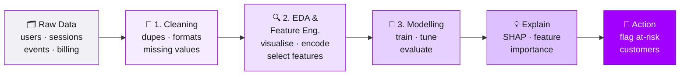

<div align="center">

# 🔮 Accenture Project Cycle Datathon
### Customer Churn & Retention - Workshop Info Pack

*An end-to-end machine-learning walkthrough: from messy raw data to an explainable churn-prediction model.*

<br>


</div>

---

> [!NOTE]
> **New here? Read the [📘 Info Pack](INFO_PACK.md) first.**
> It's the full workshop written as a readable handbook, with every concept explained in plain
> English. This README is the map; the Info Pack is the guided tour.

---

## 🎯 What this is

This repository is the teaching material for the **Accenture Project Cycle Datathon**. It takes a
realistic (synthetic) SaaS dataset and walks through the **complete data-science project cycle** used
to answer one business question:

> **Which customers are about to churn - and *why*?**

You'll go from raw, messy CSVs all the way to a tuned, explainable model that flags at-risk customers.
Everything is designed to be **run top-to-bottom** and **read like a book**.

<div align="center">

### The Project Cycle



</div>

---

## 📚 The three notebooks

Work through them **in order** - each one hands its output to the next.

| # | Notebook | What you'll do | Key tools |
|---|----------|----------------|-----------|
| **1** | [`content/cleaning.ipynb`](content/cleaning.ipynb) | Remove duplicates, fix inconsistent formats, handle missing values with **imputation**, split into train/test, and save the cleaned data. | `pandas`, `SimpleImputer`, `train_test_split` |
| **2** | [`content/EDA_feature_engineering.ipynb`](content/EDA_feature_engineering.ipynb) | **Visualise** the data, hunt for churn signals, then **engineer & encode** features and select the useful ones. | `matplotlib`, `seaborn`, `OneHotEncoder` |
| **3** | [`content/modelling.ipynb`](content/modelling.ipynb) | Train a **Random Forest** baseline, **tune** it, compare against **XGBoost**, evaluate properly, and **explain** predictions with SHAP. | `RandomForest`, `XGBoost`, `SHAP` |

---

## 🗃️ The dataset

Four synthetic tables model a SaaS product's customers and their behaviour. The star of the show is
the **`churned_30d`** flag - did the customer leave within 30 days?

| Table | Grain | What it tells us |
|-------|-------|------------------|
| 👤 **users.csv** | one row per user | Who the customer is - plan, company size, region, industry, and the **churn labels** we're predicting. |
| 🖥️ **sessions.csv** | one row per session | When and how they log in - device, OS, app version, session length. |
| ⚡ **events.csv** | one row per action | What they *do* inside the product - features used, success, latency. |
| 💳 **billing.csv** | one row per user-month | The money story - MRR, seats, discounts, overdue invoices, support tickets. |

📖 **Full column dictionary:** [`data/raw_data/README.md`](data/raw_data/README.md)

> [!TIP]
> The starter notebooks only use `users.csv`. The **sessions**, **events**, and **billing** tables are
> your competitive edge - engineer features from them to find signals the baseline misses.

---

## 🚀 Quickstart

```bash
# 1. Clone and enter the repo
git clone https://github.com/minjun504/atlassian_presentation.git
cd atlassian_presentation

# 2. (Recommended) create a virtual environment
python -m venv .venv
source .venv/bin/activate        # Windows: .venv\Scripts\activate

# 3. Install the toolkit
pip install pandas numpy scikit-learn xgboost shap matplotlib seaborn jupyter

# 4. Launch Jupyter and open the first notebook
jupyter notebook content/cleaning.ipynb
```

Then run the notebooks **in order**: `cleaning` → `EDA_feature_engineering` → `modelling`.

> [!IMPORTANT]
> Notebook 1 **writes** the cleaned files into `data/processed_data/`, and notebooks 2 & 3 **read** them
> back. If you skip ahead, the later notebooks won't find their inputs.

---

## 🗂️ Repository structure

```
atlassian_presentation/
├── 📘 INFO_PACK.md              ← the full workshop, written to read like a handbook
├── 📄 README.md                 ← you are here
│
├── content/                     ← the three workshop notebooks (run in order)
│   ├── cleaning.ipynb
│   ├── EDA_feature_engineering.ipynb
│   └── modelling.ipynb
│
├── data/
│   ├── raw_data/                ← the four source tables + column dictionary
│   │   ├── users.csv
│   │   ├── sessions.csv
│   │   ├── events.csv
│   │   ├── billing.csv
│   │   └── README.md
│   └── processed_data/          ← cleaned train/test sets (created by notebook 1)
│       ├── X_train.csv   X_test.csv
│       └── y_train.csv   y_test.csv
│
└── models/                      ← save your trained models here
```

---

## 🧭 Where to go next

<div align="center">

| If you want to… | Go to |
|---|---|
| 📖 **Understand the whole thing** end-to-end | **[INFO_PACK.md](INFO_PACK.md)** |
| 🏃 **Just start coding** | [`content/cleaning.ipynb`](content/cleaning.ipynb) |
| 🔎 **Look up a column** | [`data/raw_data/README.md`](data/raw_data/README.md) |

<br>

**Built for the Accenture Project Cycle Datathon** · Happy hacking 🚀

</div>
